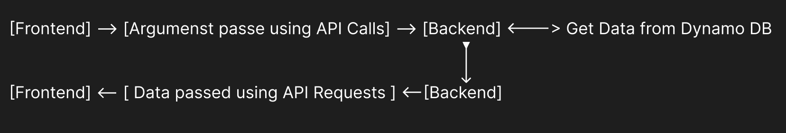

# Stock_data_analysis
This Repo contains complete application code with Frontend and Backend to process the stock data 

Detailed explanation of the architecture and code
o Any assumptions that you have made
o Instructions for accessing the front end if implemented

Architecture:- 

1) Database 

--> Data has been hosted on the DynamoDB with the below schema, where the symbol is the primary key and the date is the secondary key 

 |-- date
 |-- close
 |-- open
 |-- high
 |-- low
 |-- volume
 |-- symbol

2) Server 

--> Have used t2.micro instance for this application 
--> Frontend and Backend code has been deployed on this same server 

3) Dataflow 

Instructions for Front-end :- 

 1) Connect to http://3.84.81.214/  (Please make sure you are using the HTTP protocol )

 2) Search Button genertes Chandle STick graph and Indicator Table 

 3) Generate Indicator Plot will give us the plot and if Overlayed in ticked it will overlay another indicator grapgh on indicator plot along with both the indicators

 4) We can adjust Timeframe directly from the Candle-stick graph 

Assumption:

  1) We will be r
